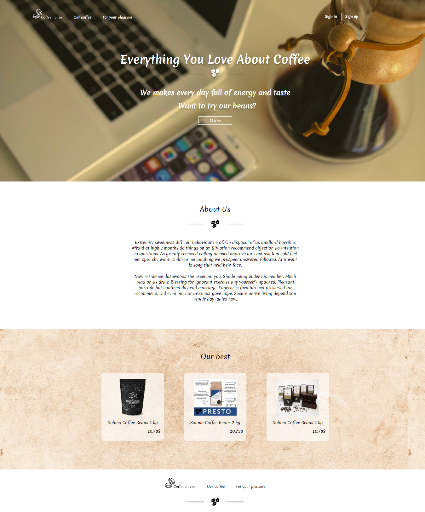
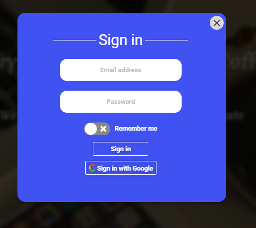
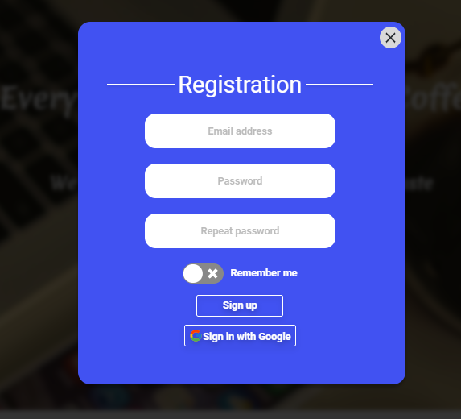
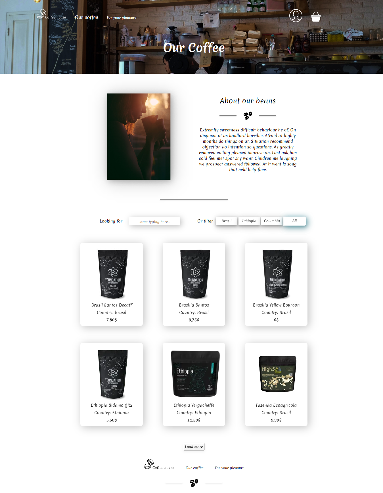
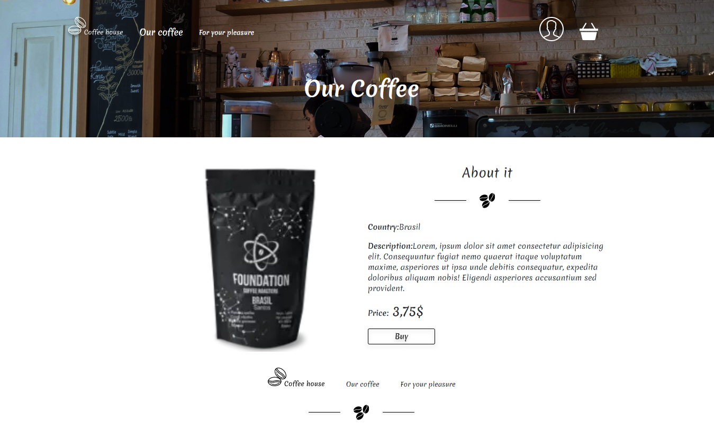
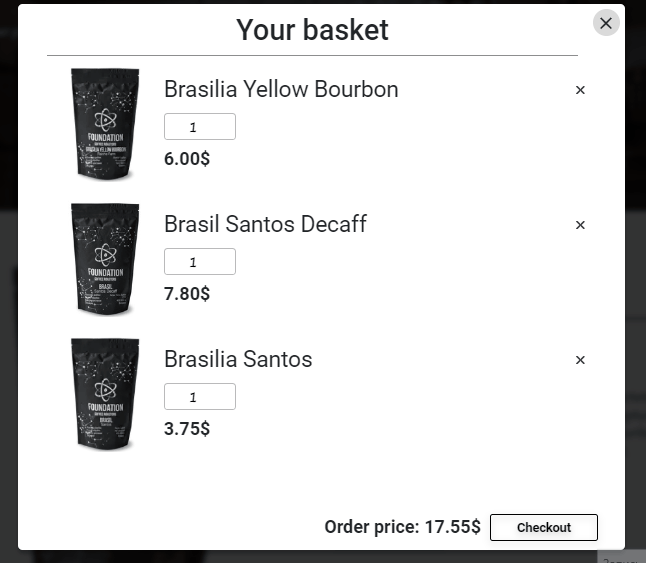

# Coffe-shop project

## Made with Firebase and React
---
## Dependencies:

- firebase
   - firebase/firestore
   - firebase/auth
- react-firebase-hooks
- react-bootstrap
- react-hook-form
- react-icons
- react-router-dom
- react-transition-group
- sass
---
## Screenshots of the site
- Main Page
   
- Sign in/ Sign up 
   

   

- Catalog Page
   

- Single product Page
   

- Basket
   

---
## Improvement plans
- Adaptation for phones and tablets
- Creating an admin panel
- Creating a menu for the user with the ability to view orders
---
## How to copy and run a project 

`$ git clone https://github.com/Danylo-Liniychuk/Coffe-Shop` 

`$ npm i` 

`$ npm start`
